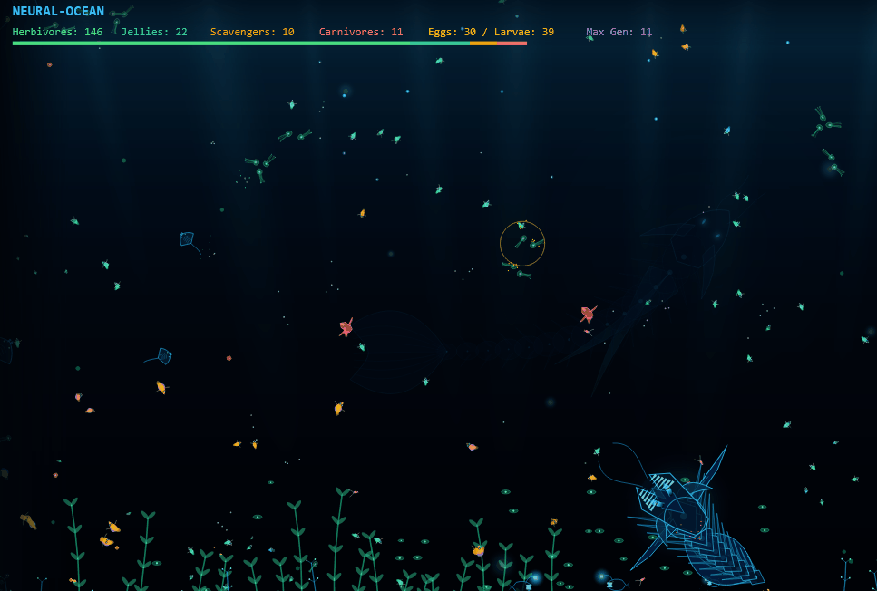

# Neural Ocean (BIO-COSMOS)

A 2D deep-sea ecosystem simulation where autonomous neural creatures evolve, hunt, and mutate in real time.

[Play Live Demo](https://sitrozyi.github.io/neural-ocean/)

---

## Controls

### Simulation & Tools
- `1` - `5` : Select God Tool (Inspect, Feed All, Meteor, Spawn Larva, Spawn Apex)
- `T` : Toggle Tool Menu / Species Catalog / Save Slots
- `Space` : Reset camera center / Deselect creature
- `Z` / `X` / `C` / `V` / `B` : Change simulation speed (0x to 6x)
- `P` : Pause / Resume

### Navigation
- `Left Click` + Drag / `Middle Click` : Pan camera
- `Mouse Wheel` / `Pinch` : Zoom in / out
- `Click on creature` (with Tool 1) : Inspect neural network and vitals

---

## Key Features

- **Neural Brain & Hebbian Learning** : Creatures perceive their environment (threats, food, obstacles, peer signals) and learn behaviors in real time.
- **Genetic Evolution & Mutation** : Dynamic traits such as armor, size, bioluminescence, poison, and diet evolve across generations.
- **Species Catalog** : Discover and record up to 18 unique mutated species.
- **Interactive God Tools** : Feed populations, induce mutations, spawn apex predators, or trigger meteors.
- **Local Save Slots** : Save and restore up to 3 separate ocean states.

---

## Tech Stack

- TypeScript / HTML5 Canvas / Web Audio API
- Vite
